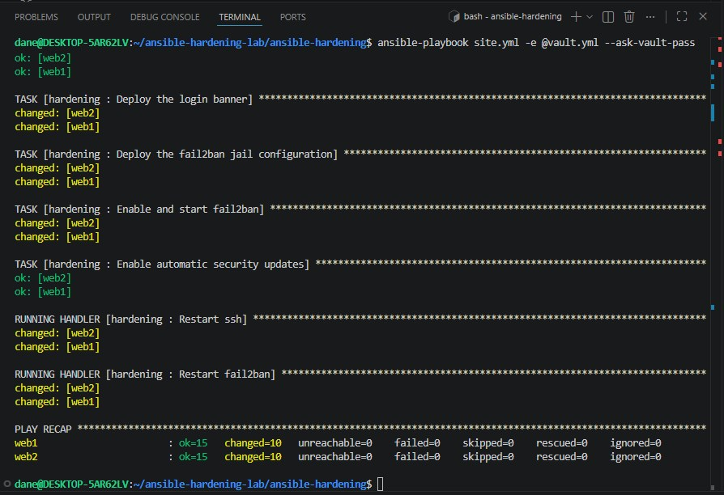
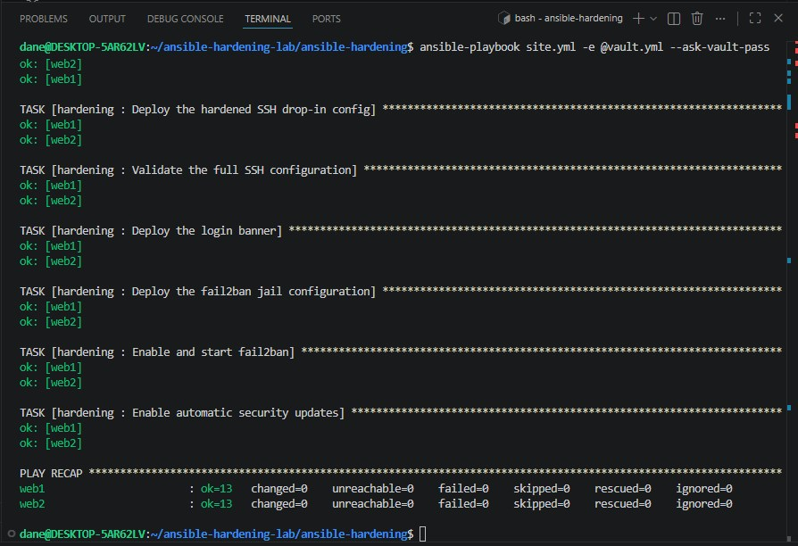
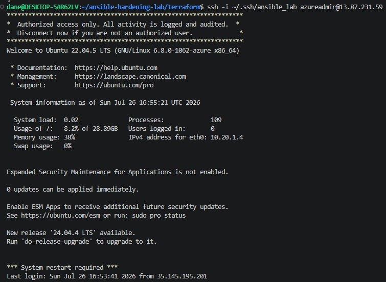
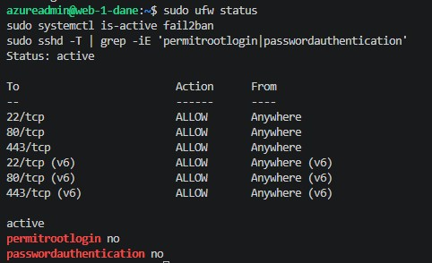

# Automated Security Hardening Baseline with Terraform and Ansible

**Part of my Azure lab series.** Terraform provisions a fleet of Linux servers in Azure, and an idempotent Ansible role brings every one of them up to a hardened standard: SSH lockdown, host firewall, intrusion prevention, automatic patching, and a login banner.

📺 **Video walkthrough:** _[Loom link coming soon]_

---

## The Problem This Solves

A company spins up servers and ships product. Six months later an auditor asks: are all your servers configured the same way, and can you prove it? The honest answer is usually no. Someone hardened the first three by hand, the fourth was built in a hurry, and nobody remembers what was done to the fifth. That gap is configuration drift, and it is how breaches happen.

This lab fixes that with a repeatable baseline. Terraform builds the fleet, Ansible configures it, and because the role is idempotent, running it a second time changes nothing. It both deploys the baseline on a fresh server and corrects drift on an existing one.

---

## Architecture


Terraform builds the network and the VMs, then writes the Ansible inventory automatically so there is no copying IP addresses by hand. Ansible connects over SSH and applies the hardening role to both hosts.

**Environment and tools**

- Cloud: Microsoft Azure
- Provisioning: Terraform (HCL) — VNet, subnet, deny-all NSG, 2x Ubuntu 22.04 VMs
- Configuration: Ansible — reusable role with tasks, handlers, templates, group_vars
- Secrets: Ansible Vault (AES256, encrypted at rest)
- Targets: 2x Ubuntu 22.04 LTS

---

## What the Role Does

The hardening role applies the same baseline to every host in the fleet:

- **SSH lockdown** — root login disabled, password authentication disabled, key-only access, `MaxAuthTries` limited, deployed as a drop-in config that is validated with `sshd -t` before any restart so a bad config can never lock you out.
- **Host firewall (ufw)** — required ports opened first, then a default-deny policy on incoming traffic. Order is deliberate: SSH is allowed before deny-all takes effect.
- **Intrusion prevention (fail2ban)** — bans IPs after repeated failed logins, configured in `jail.local` so package updates never overwrite it.
- **Automatic patching** — unattended-upgrades enabled so the fleet stays current on its own.
- **Login banner** — an authorized-use notice shown before every login.
- **Secret handling** — the one secret (the admin password) lives in an encrypted Ansible Vault, never in plaintext.

Structure that makes it reusable: a proper role layout (`tasks`, `handlers`, `defaults`, `templates`), handlers so services restart only when config actually changed, Jinja2 templates for per-host config, and `group_vars` to separate data from logic.

---

## The Idempotency Proof

This is the whole point of configuration management, so it gets its own screenshots.

**First run** — the role finds unconfigured servers and makes changes. `ok=15 changed=10 failed=0` on both hosts, and both handlers fire because the SSH and fail2ban configs actually deployed.



**Second run** — same command, no changes. `changed=0` on every configuration task, because the servers already match the desired state. Ansible checked every setting, found it already correct, and did nothing. No handlers fire because nothing notified them.



That is convergence. Run it on a fresh server or an existing one and you get the identical result.

---

## Verification

SSH into a host and the authorized-use banner prints before the prompt, with key-only login working:



On the box, the hardening holds up:



- `ufw status` shows active with rules for 22, 80, and 443
- `systemctl is-active fail2ban` returns active
- `sshd -T` confirms `permitrootlogin no` and `passwordauthentication no`

---

## Problems I Hit and Fixed

The lab was written against an older Ansible, and mine was newer, so two things broke that were worth understanding rather than just patching.

**Removed YAML callback plugin.** My `ansible.cfg` set `stdout_callback = yaml`, which pointed at the old `community.general.yaml` callback. That plugin was removed in newer Ansible and replaced by a built-in option. The error message named its own fix: the behavior is now `result_format = yaml` on the built-in `default` callback. Swapped those two lines and the output came back.

**Invalid characters in the password salt.** The `user` task hashes the admin password with a hardcoded salt, `lab_static_salt`. Newer Ansible enforces the sha512_crypt salt alphabet, which is `[a-zA-Z0-9./]` only, and the underscores were rejected. Changed the salt to letters and numbers and it hashed fine.

The salt is hardcoded on purpose, which is the more interesting lesson underneath the error. `password_hash` generates a random salt by default, so the hash comes out different every run and the task reports "changed" forever. Pinning the salt makes the hash stable so the task converges. Even hashing a password can break idempotency if you are not careful.

---

## Deploy It Yourself

```bash
# 1. Provision the fleet
cd terraform
export ARM_SUBSCRIPTION_ID=$(az account show --query id -o tsv)
terraform init
terraform apply          # builds 2 VMs and writes ../ansible-hardening/inventory.ini

# 2. Harden the fleet
cd ../ansible-hardening
ansible all -m ping                                     # confirm reachability
ansible-playbook site.yml -e @vault.yml --ask-vault-pass  # first run: makes changes
ansible-playbook site.yml -e @vault.yml --ask-vault-pass  # second run: changed=0

# 3. Tear down
cd ../terraform
terraform destroy
```

You provide the SSH key, your public IP is looked up automatically for the NSG rule, and Terraform generates the inventory. Note: `vault.yml` and `inventory.ini` are gitignored — you create your own vault locally with `ansible-vault encrypt`.

---

## What I'd Add Next

- Pull the admin password from Azure Key Vault at runtime instead of a local Vault file
- Add a molecule test scenario to verify the role in CI
- Extend the role with CIS-benchmark controls for a fuller baseline